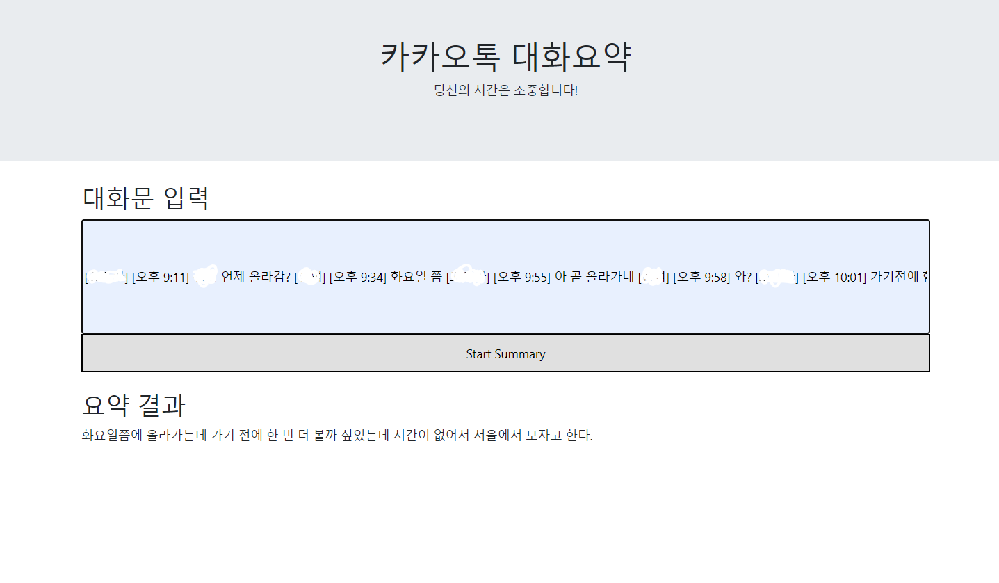

## 💡프로젝트 소개
###  base project : [Base Project link](https://github.com/AIFFEL-NLP-PROJECT/Aiffelthon)
```
1️⃣ 주제 : KoBART 한국어 대화문 생성요약 서비스
2️⃣ 목표 : KoBART로 학습한 한국어 대화문 요약 모델을 Flask를 통해서 웹 서비스로 배포
3️⃣ 설명 : 기존의 Aiffel에서 진행한 대화문 생성요약 프로젝트를 베이스로 하여 KoBART 모델을 개선 및 서빙을 진행할 것 
```



### 해당 프로젝트에 관한 자세한 설명은 블로그에 정리해 놓았다.<br>
- [KoBART를 활용한 카카오톡 대화 요약 서비스_1(feat.개요와 데이터)](https://velog.io/@jx7789/%EC%B9%B4%EC%B9%B4%EC%98%A4%ED%86%A1-%EB%8C%80%ED%99%94-%EC%9A%94%EC%95%BD-%EC%84%9C%EB%B9%84%EC%8A%A4-pepkrzfe)<br>
- [KoBART를 활용한 카카오톡 대화 요약 서비스_2(feat.모델과 평가)](https://velog.io/@jx7789/KoBART%EB%A5%BC-%ED%95%A0%EC%9A%A9%ED%95%9C-%EC%B9%B4%EC%B9%B4%EC%98%A4%ED%86%A1-%EB%8C%80%ED%99%94-%EC%9A%94%EC%95%BD-%EC%84%9C%EB%B9%84%EC%8A%A42feat.%EB%AA%A8%EB%8D%B8%EA%B3%BC-%ED%8F%89%EA%B0%80)
- [KoBART를 활용한 카카오톡 대화 요약 서비스_3(feat.생성 전력과 허깅페이스)](https://velog.io/@jx7789/KoBART%EB%A5%BC-%ED%99%9C%EC%9A%A9%ED%95%9C-%EC%B9%B4%EC%B9%B4%EC%98%A4%ED%86%A1-%EB%8C%80%ED%99%94-%EC%9A%94%EC%95%BD-%EC%84%9C%EB%B9%84%EC%8A%A43feat.%EC%83%9D%EC%84%B1-%EC%A0%84%EB%A0%A5%EA%B3%BC-%ED%97%88%EA%B9%85%ED%8E%98%EC%9D%B4%EC%8A%A4)
- [KoBART를 활용한 카카오톡 대화 요약 서비스_4(feat.서빙)](https://velog.io/@jx7789/KoBART%EB%A5%BC-%ED%99%9C%EC%9A%A9%ED%95%9C-%EC%B9%B4%EC%B9%B4%EC%98%A4%ED%86%A1-%EB%8C%80%ED%99%94-%EC%9A%94%EC%95%BD-%EC%84%9C%EB%B9%84%EC%8A%A44feat.%EC%84%9C%EB%B9%99)

---
## 1. Model Test
해당 모델은 HuggingFace에 업로드하여 pipeline으로 쉽게 사용할 수 있다.
```
pip install transformers==4.25.1
```
```
from transformers import pipeline

model_name = "jx7789/kobart_summary_v2"

dialogue = ["다들 설날에 함 보자?", "며칠에 볼지는 안 정했지?", "ㅇㅇ 아직 안정함ㅋㄱㅋ", "ㅇㅋ", "설 당일은 다들 바쁠테고", "토요일이나 월 중에 보면 될려나", "토욜", "저녁 한끼하고", "볼링이나 칩시다"]

gen_kwargs = {"length_penalty": 2.0, "num_beams":8, "max_length": 128}

pipe = pipeline("summarization", model=model_name)
print(pipe("[sep]".join(dialogue), **gen_kwargs)[0]["summary_text"])
```
##### output : 다들 설날에 볼지 아직 정하지 않았고 당일은 다들 바쁠 테니 토요일 저녁에 볼링이나 칩시다.

## 2. Service Test
### 1) 로컬 Test
```
pip install transformers==4.25.1
pip install Flask 
```
```
python run.py
```
### 2) Docker Test
- Ubuntu-18.04(WSL) 환경에서 사용
```
docker build -t flask .
docker run -d -p 3000:3000 flask
```

---
## 🗓️ 프로젝트 개선 진행
### 1. 모델링
#### [최종 결과 코드 보러가기](https://github.com/jx-dohwan/KoBART_generation_summary_service/blob/main/make_models/KoBART_Summary_v3.ipynb)
|기존 서비스|개선 서비스|진행사항(%)|RougeL F1|
|:---------:|:----------:|:------:|:------:|
|성능저하시키는 전처리|불필요한 전처리 기법 제거|100%||
|mecab으로 길이측정|model tokenizer로 길이측정|100%||
|학습, 검증 데이터 동일한 전처리 적용|학습, 검증 데이터 전처리 구분|100%||
|테스트 데이터셋 미구축|[테스트 데이터셋 구축](https://github.com/jx-dohwan/KoBART_generation_summary_service/blob/main/make_models/kobart_summary.ipynb)|100%|0.2386|
|BOS, SEP 미사용|[BOS, SEP사용](https://github.com/jx-dohwan/KoBART_generation_summary_service/blob/main/make_models/KoBART_Summary_v2.ipynb)|100%|0.2439|
|일반 fine-tuning|[도메인 적응](https://github.com/jx-dohwan/KoBART_generation_summary_service/blob/main/make_models/domain_adaptation.ipynb)|100%|0.2526|
|모델 미배포|[fine-tuning](https://huggingface.co/jx7789/kobart_summary_v3)<br>[post-pretrain](https://huggingface.co/jx7789/kobart_post_pratrain)|100%||

### 2. Serving
개선 서비스|진행사항(%)|
|:----------:|:------:|
|[웹 구현](https://github.com/jx-dohwan/KoBART_generation_summary_service/tree/main/Serving)|100%|
|[전처리 속도 개선](https://github.com/jx-dohwan/KoBART_generation_summary_service/blob/main/Serving/preprocessor.py)|100%|
|[도커 빌드](https://github.com/jx-dohwan/KoBART_generation_summary_service/blob/main/Serving/Dockerfile)|100%|


---
